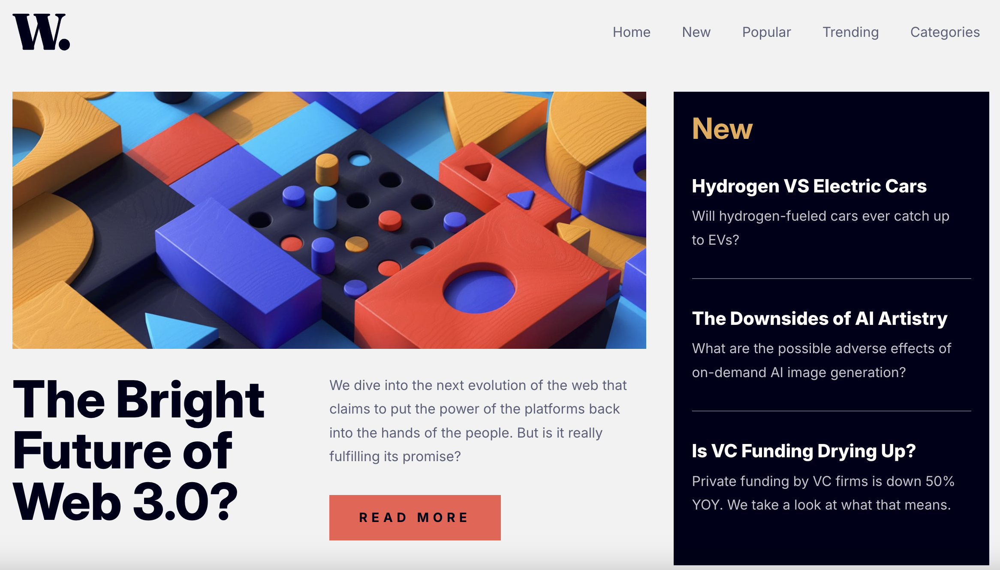

# Frontend Mentor - News homepage solution

This is a solution to the [News homepage challenge on Frontend Mentor](https://www.frontendmentor.io/challenges/news-homepage-H6SWTa1MFl). Frontend Mentor challenges help you improve your coding skills by building realistic projects.

## Table of contents

- [Overview](#overview)
  - [The challenge](#the-challenge)
  - [Screenshot](#screenshot)
  - [Links](#links)
  - [Built with](#built-with)
- [Author](#author)

## Overview

Accessible React News Homepage. In the app implemented custom burger component with animation, animated backdrop and menu using css. Correct work with "tab" button for accessibility is implemented by tabIndexes attributes for anchor tags and focusing first element in useEffect by useRef.current. App has routing thorough menu. App displays mobile and desktop version layouts.

### The challenge

Users should be able to:

- View the optimal layout for the interface depending on their device's screen size
- See hover and focus states for all interactive elements on the page

### Screenshot

### Links

- Solution URL: [https://github.com/NikitaVologdin/React-News-Homepage](https://github.com/NikitaVologdin/React-News-Homepage)
- Live Site URL: [Add live site URL here](https://your-live-site-url.com)

## My process

### Built with

- Semantic HTML5 markup
- CSS custom properties
- Flexbox
- CSS Grid
- Mobile-first workflow
- Accessibility
- [React](https://reactjs.org/) - JS library
  – React-Router

## Author

- Website - [Nikita Vologdin](https://vologdin.eu/)
- Frontend Mentor - [@NikitaVologdin](https://www.frontendmentor.io/profile/NikitaVologdin)
